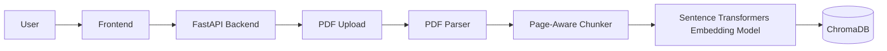
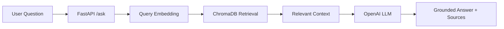

# AI Document Assistant

AI Document Assistant is a local Retrieval-Augmented Generation (RAG) application for asking questions about uploaded PDF documents. It validates and parses PDFs, chunks extracted text with page metadata, creates embeddings, stores them in ChromaDB, retrieves relevant context, and generates grounded answers with source information.

The project is designed as a clean portfolio application: a FastAPI backend, local vector storage, a lightweight HTML/CSS/JavaScript frontend, and focused automated tests.

## Features

- PDF upload through API or frontend
- Filename sanitization, file-size validation, duplicate detection, and invalid PDF rejection
- Text extraction from text-based PDFs with PyMuPDF
- Page-aware, word-based chunking with configurable chunk overlap
- Embedding generation with Sentence Transformers using `all-MiniLM-L6-v2`
- Persistent local ChromaDB vector storage
- Semantic retrieval across all documents or selected documents
- Question answering through a grounded OpenAI LLM prompt
- Structured source metadata including document ID, filename, page number, and excerpt
- Document listing and deletion
- Lightweight frontend for upload, document selection, Q&A, source display, and deletion
- Input validation and HTTP error handling for common failure cases
- Automated tests for parsing, chunking, ingestion, retrieval, RAG behavior, and document management

## Architecture





## Project Structure

```text
.
├── backend/
│   └── app/
│       ├── api/
│       │   ├── ask.py
│       │   ├── documents.py
│       │   └── upload.py
│       ├── models/
│       │   ├── chunk.py
│       │   ├── document.py
│       │   └── metadata.py
│       ├── prompts/
│       │   └── grounded_answer.py
│       ├── services/
│       │   ├── chunker.py
│       │   ├── document_service.py
│       │   ├── embedding.py
│       │   ├── embedding_service.py
│       │   ├── llm.py
│       │   ├── pdf_parser.py
│       │   ├── preprocessor.py
│       │   ├── rag.py
│       │   ├── retrieval.py
│       │   └── vectordb.py
│       ├── config.py
│       └── main.py
├── frontend/
│   ├── app.js
│   ├── index.html
│   └── styles.css
├── tests/
│   ├── test_chunker.py
│   ├── test_documents.py
│   ├── test_ingestion_retrieval.py
│   ├── test_pdf_parser.py
│   └── test_rag.py
├── .env.example
├── .gitignore
├── README.md
└── requirements.txt
```

## Tech Stack

- Python
- FastAPI
- Uvicorn
- PyMuPDF
- Sentence Transformers
- Transformers
- ChromaDB
- OpenAI API
- HTML, CSS, and JavaScript
- pytest
- httpx / FastAPI TestClient

## How It Works

1. A user uploads a PDF through the frontend or `POST /upload`.
2. The backend sanitizes the filename, enforces the upload size limit, saves the file temporarily, and computes a SHA-256 content hash.
3. PyMuPDF attempts to parse the file as a real PDF and extract text from each page.
4. Empty, invalid, or textless PDFs are rejected.
5. The SHA-256 hash becomes the stable document ID, which prevents duplicate indexing of the same PDF content.
6. Extracted page text is normalized and split into overlapping word chunks while preserving page numbers.
7. Each chunk is embedded with the Sentence Transformers model `all-MiniLM-L6-v2`.
8. Chunk text, embeddings, and metadata are stored in a persistent local ChromaDB collection.
9. When a user asks a question through `POST /ask`, the question is embedded and used to retrieve relevant chunks from ChromaDB.
10. Retrieval can search all indexed documents, one selected document, or a selected list of documents.
11. Retrieved chunks are formatted into a bounded context prompt.
12. The OpenAI model is instructed to answer only from retrieved document context.
13. The API returns the answer plus structured source excerpts from the retrieved chunks.

## Installation

Run these commands from the repository root in Windows PowerShell:

```powershell
git clone <your-repository-url>
cd AI-PDF-ASSISTANT

python -m venv backend\.venv
.\backend\.venv\Scripts\Activate.ps1

python -m pip install --upgrade pip
python -m pip install -r requirements.txt
```

Configure environment variables before starting the app:

```powershell
$env:OPENAI_API_KEY = "your_key_here"
```

Optional configuration:

```powershell
$env:AI_DOCUMENT_ASSISTANT_DATA_DIR = ".\data"
$env:AI_DOCUMENT_ASSISTANT_MAX_UPLOAD_MB = "15"
$env:AI_DOCUMENT_ASSISTANT_OPENAI_MODEL = "gpt-4.1-mini"
```

Start FastAPI:

```powershell
python -m uvicorn app.main:app --reload --app-dir backend
```

Open the frontend:

```text
http://127.0.0.1:8000
```

Open the API docs:

```text
http://127.0.0.1:8000/docs
```

## Environment Variables

Required for live answer generation:

```env
OPENAI_API_KEY=your_key_here
```

Optional variables:

```env
AI_DOCUMENT_ASSISTANT_DATA_DIR=./data
AI_DOCUMENT_ASSISTANT_MAX_UPLOAD_MB=15
AI_DOCUMENT_ASSISTANT_OPENAI_MODEL=gpt-4.1-mini
```

Additional optional RAG limits supported by the configuration:

```env
AI_DOCUMENT_ASSISTANT_MAX_TOP_K=8
AI_DOCUMENT_ASSISTANT_MAX_CONTEXT_CHARS=12000
```

The repository includes `.env.example` for reference. The application reads environment variables from the active shell environment.

## Usage

1. Start the backend with Uvicorn.
2. Open `http://127.0.0.1:8000`.
3. Upload one or more text-based PDF documents.
4. Select no documents to search all documents, select one document to search only that document, or select multiple documents to search across that selected set.
5. Ask a question.
6. Review the grounded answer and retrieved source excerpts.
7. Use the document panel to refresh or delete indexed documents.

### API Examples

Upload a PDF:

```powershell
curl.exe -X POST "http://127.0.0.1:8000/upload" `
  -F "file=@sample.pdf;type=application/pdf"
```

Ask across all indexed documents:

```powershell
curl.exe -X POST "http://127.0.0.1:8000/ask" `
  -H "Content-Type: application/json" `
  -d '{ "question": "What is this document about?", "top_k": 4 }'
```

Ask about one document:

```powershell
curl.exe -X POST "http://127.0.0.1:8000/ask" `
  -H "Content-Type: application/json" `
  -d '{ "question": "What are the key points?", "document_id": "DOCUMENT_ID_HERE", "top_k": 4 }'
```

Ask across selected documents:

```powershell
curl.exe -X POST "http://127.0.0.1:8000/ask" `
  -H "Content-Type: application/json" `
  -d '{ "question": "Compare the main topics.", "document_ids": ["DOCUMENT_ID_1", "DOCUMENT_ID_2"], "top_k": 4 }'
```

List indexed documents:

```powershell
curl.exe "http://127.0.0.1:8000/documents"
```

Delete a document:

```powershell
curl.exe -X DELETE "http://127.0.0.1:8000/documents/DOCUMENT_ID_HERE"
```

Health check:

```powershell
curl.exe "http://127.0.0.1:8000/health"
```

## API Endpoints

| Method | Endpoint | Purpose |
| --- | --- | --- |
| `GET` | `/` | Serves the frontend |
| `GET` | `/health` | Returns backend health status |
| `POST` | `/upload` | Uploads, validates, chunks, embeds, and indexes a PDF |
| `POST` | `/ask` | Retrieves relevant chunks and returns a grounded answer with sources |
| `GET` | `/documents` | Lists indexed documents and metadata |
| `DELETE` | `/documents/{document_id}` | Removes a document's vectors and stored PDF when available |

## Testing

Run the test suite from the repository root:

```powershell
python -m pytest tests -q
```

Existing tests cover:

- PDF parsing and rejection of invalid or textless PDFs
- Page-aware chunking, overlap behavior, and metadata retention
- Upload indexing, filename sanitization, vector metadata, and duplicate handling
- Retrieval filtering by selected document IDs
- Question validation and invalid document selection
- Prompt/context construction and source formatting
- Document listing and deletion

## Security and Privacy

- Uploaded PDFs are stored locally under the configured data directory.
- ChromaDB vector data is stored locally under the configured data directory.
- Relevant retrieved text chunks are sent to OpenAI when generating answers.
- API keys should be provided through environment variables and kept out of source control.
- `.env`, uploaded documents, vector database data, virtual environments, caches, and generated local data are excluded by `.gitignore`.
- The application does not currently implement authentication, user accounts, encryption, or access control.

## Known Limitations

- Built as a local, single-user portfolio application.
- Requires an OpenAI API key for live answer generation.
- Supports text-based PDFs only; scanned PDFs are not handled because OCR is not implemented.
- No persistent conversation memory or chat history.
- No streaming responses.
- First embedding model load can be slow while the model initializes or downloads.
- The frontend is intentionally lightweight and uses vanilla HTML, CSS, and JavaScript.

## Future Improvements

- OCR support for scanned PDFs
- Streaming answer responses
- Conversation memory
- Better retrieval or reranking
- Docker deployment for easier setup

## Project Highlights

This project demonstrates practical AI engineering concepts including RAG architecture, embedding pipelines, vector database storage, semantic retrieval, FastAPI API design, grounded generation, source attribution, input validation, local file handling, and focused automated testing.
